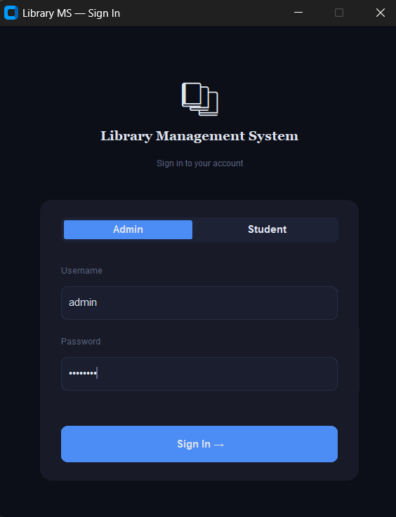
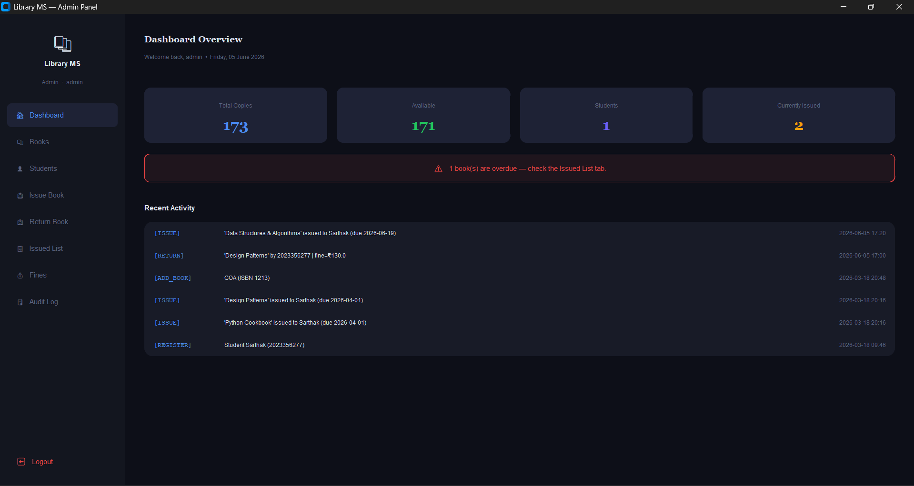
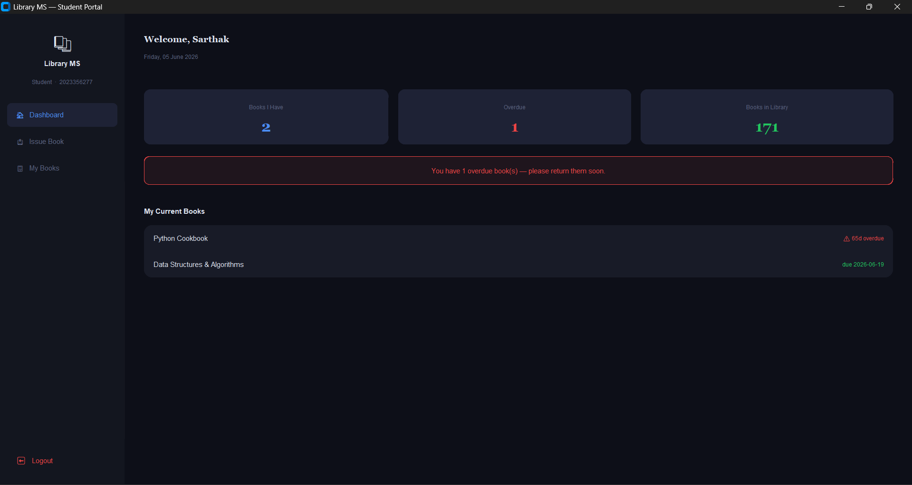

# 📚 Library Management System

A modern desktop-based **Library Management System** developed using **Python, CustomTkinter, and MySQL**. The application provides dedicated interfaces for administrators and students, enabling efficient book management, user registration, issue/return operations, fine tracking, and audit logging through an intuitive graphical interface.

---

## 📸 Screenshots

### 🔐 Login Page

<p align="center">
  
</p>

### 👨‍💼 Admin Panel

<p align="center">
  
</p>

### 🎓 Student Panel

<p align="center">
  
</p>

---

## 🗂 Project Structure

```text
library_ms/
├── main_app.py        # Main application window & navigation
├── login_window.py    # Login screen (Admin / Student)
├── tabs_admin.py      # Admin dashboard and management modules
├── tabs_student.py    # Student portal functionality
├── ui_helpers.py      # Shared UI components and themes
├── database.py        # Database schema and query operations
├── config.py          # Database configuration (excluded from Git)
├── .gitignore
└── README.md
```

---

## 🚀 Key Features

### Admin Features

* Dashboard with real-time library statistics
* Book catalog management (Add, Search, Update)
* Student registration and account management
* Issue and return books with automatic fine calculation
* Overdue tracking and fine management
* Audit logs for administrative actions
* Searchable dropdowns with live filtering

### Student Features

* Secure student authentication
* Browse available books
* Self-book issue functionality
* View issued books and due dates
* Fine and overdue status monitoring
* Personalized dashboard statistics

---

## 🎨 User Interface Highlights

* Modern dark-themed interface
* Responsive sidebar navigation
* Smooth dropdown animations
* Search-as-you-type filtering
* Color-coded availability indicators
* Separate Admin and Student workflows
* Consistent and intuitive user experience

---

## 🛡 Security Features

* SHA-256 password hashing
* Role-based access control
* Secure authentication system
* Database credentials isolated in configuration files
* Automatic database schema migration support

---

## ⚙️ Installation & Setup (Web App)

### 1. Clone the Repository

```bash
git clone https://github.com/Sarthak-1304/Library-Management-.git
cd Library-Management-
```

### 2. Install Dependencies

```bash
pip install -r requirements.txt
```

### 3. Run the Application locally

```bash
python app.py
```

The application automatically creates the SQLite database (`library.db`), runs schema migrations, seeds sample books and demo accounts, and starts the development server at `http://127.0.0.1:5000/`.

---

## 🚀 Deployment (Render)

This application is ready for one-click deployment to **Render** using the provided `render.yaml` configuration.

1. Connect your GitHub repository to Render.
2. Select **New** > **Blueprint**.
3. Render will automatically parse `render.yaml` and configure the Flask web server.

---

## 🔑 Default Login Credentials

For convenience, the login page contains **Demo Access buttons** allowing users/recruiters to log in instantly with a single click.

### Admin
* **Username**: `admin`
* **Password**: `admin123`

### Student
* **Student ID**: `STU2024001`
* **Password**: `student123`

---

## 🛠 Tech Stack

* **Backend**: Python, Flask
* **Database**: SQLite3 (Single source of truth)
* **Frontend**: HTML5, Vanilla CSS3 (Custom Dark Theme matching CustomTkinter layout), JavaScript (ES6, AJAX integrations)
* **Deployment**: Render / Gunicorn

---

## 📈 Future Enhancements

* Email notifications for due dates
* Barcode/QR code integration
* Book reservation system
* Report generation and export
* Multi-admin support
* Cloud database deployment

---

## 👨‍💻 Author

Sarthak Bhardwaj
